# FF7 Remake Speedrun Races - Race Control

This repository contains the Race Control NodeCG bundle for managing speedrun races for Final Fantasy VII Remake.

It supports up to 5 runners, with an additional host and will handle timing for each runner, switching between/focusing on particular runners or switching audio, results and stream titles, etc.

An example of it being used for a 4-person race [is here](https://www.youtube.com/watch?v=qXMxPy1n-ts).

## Requirements

- NodeCG
- OBS
- OBS Websocket Plugin

## Setup

### Installation

Follow the NodeCG install instructions and also install the OBS Websocket plugin. This is required for Race Control to be able to manage OBS and switch between scenes, mute sources, etc.

Extract the ff7remake bundle into the `bundles` directory of NodeCG, so that the structure is `bundles\77fremake`.

### Building Javascript/CSS

You can rebuild the Javascript/CSS after modifications by using `npm run build`. This will run webpack and update the built assets.

### Configuration

Once it is running, you can go to the dashboard by visiting `http://localhost:9090` in your browser. The first thing to do is to connect it to OBS using the OBS Connection panel. Once that's done, you will be able to select scenes and sources.

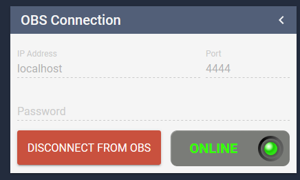

Next you'll want to set some basic titles and such for the graphics. This is done in this panel.

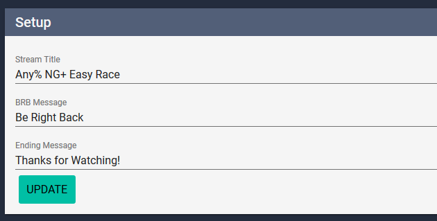

The purpose of each bit of text is pretty obvious.

The next step is to set up your runners.

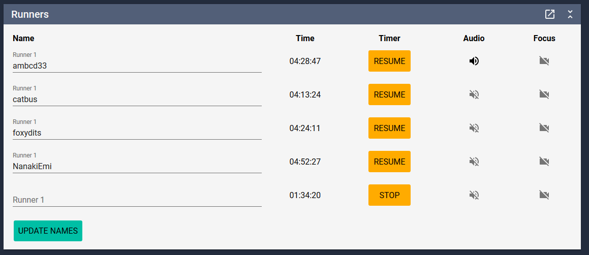

Enter the names of the runners and click 'Update Names'. This will set the names on the race view. We'll run through the rest of the options later.

Now you can set up your interview titles. There are spaces for people's Twitch channels and optionally pronouns.

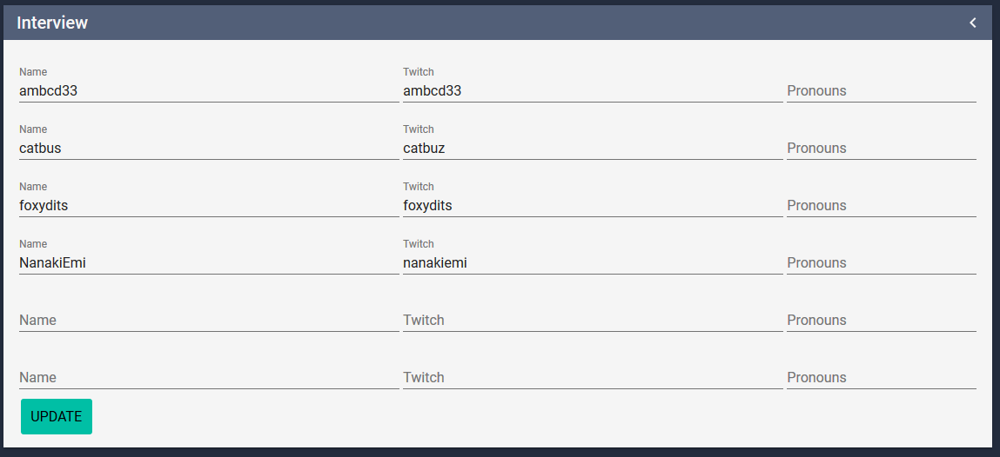

When done, click 'Update' and it will be saved. There are 6 lines here so that you can have an optional host for interviews.

Finally you need to tell Race Control which sources to use for audio for the runners, and which scenes relate to which runner for when you focus on them.

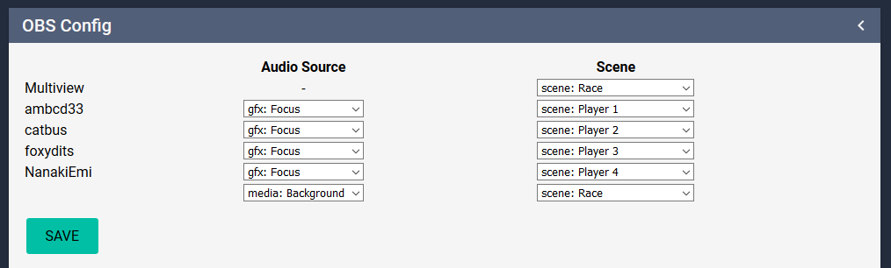

The scenes should be straight-forward enough, the audio sources should be their browser sources for their twitch stream as this will control game audio.

Once all this is done, you're good to go!

## Usage

### Stream Countdown

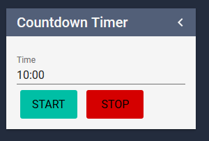

It can take some time to configure everything, so to set the countdown timer on the Holding scene, use the Countdown timer panel. You can put in a time in Minutes:Seconds, eg. 10:00 and it will start a countdown. When it reaches zero, no text will be displayed.

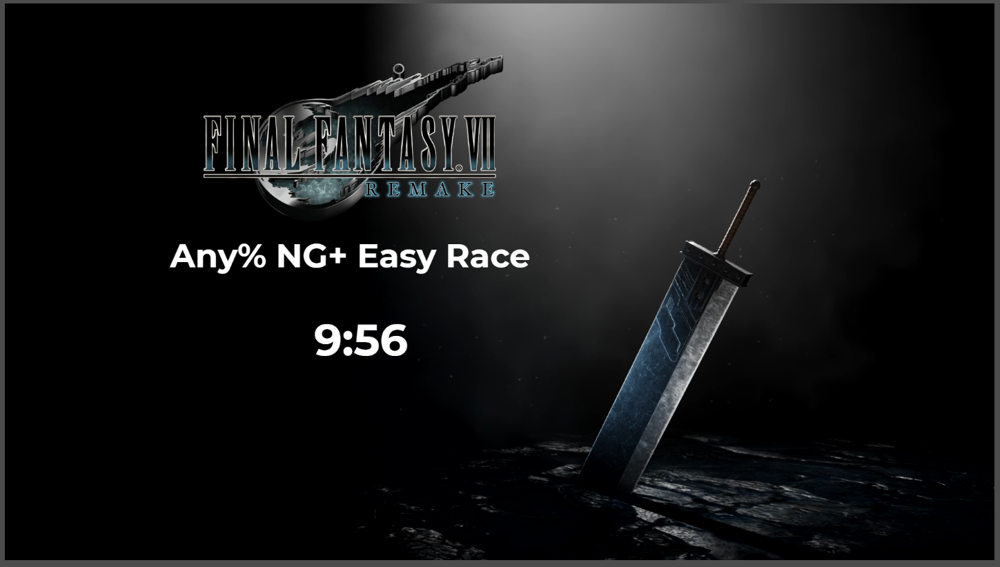

Once you're ready to begin the race, you can cut to the interview scenes or straight to the Race scene. 

### Timing

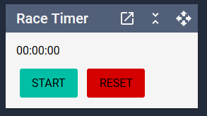

This is the main race timer. When you click Start, it will start timing, when you click Stop, it will Stop timing (but continue running in the background - in-case you accidentally stopped it). Reset will reset the timer and stop it.

Next to each runner in the Runners panel, you'll see their own time and a Stop button. When they finish the race, hit the Stop button next to their time, and it'll stop their timer, while the others continue.

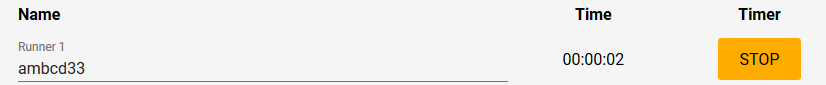

If you incorrectly stopped their timer, you can resume it using the Resume button. It will return to the same time as the main race timer.

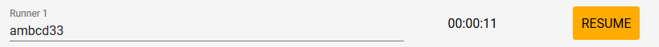

Stopping a runner's timer will put their finish time over the centre of their game window, it will also be used on the results page for showing where people finished.

### Audio

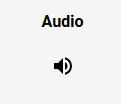

The audio column on the runners panel allows you to choose which audio goes through to the stream. This is done by muting other runner sources and unmuting the one you've chosen. If you choose to focus video on another player, it will switch to their audio automatically. The active audio is shown on-stream with a speaker icon.

### Focus

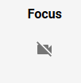

This allows you to switch from the race view to instead focus on an individual runner. This could be if they're doing something that you want to show to the audience, such as a key boss fight or skip.

Clicking on the Focus icon will switch to their player view and clicking on it again returns to the race view.

## Support

If you need support with this package, please message Mintopia#0042 on Discord or find me on the [FF7 Remake Speedrun Discord](https://discord.gg/WH2ktdJ).

## License

The MIT License (MIT)

Copyright (c) 2021 Jessica Smith

Permission is hereby granted, free of charge, to any person obtaining a copy of this software and associated documentation files (the "Software"), to deal in the Software without restriction, including without limitation the rights to use, copy, modify, merge, publish, distribute, sublicense, and/or sell copies of the Software, and to permit persons to whom the Software is furnished to do so, subject to the following conditions:

The above copyright notice and this permission notice shall be included in all copies or substantial portions of the Software.

THE SOFTWARE IS PROVIDED "AS IS", WITHOUT WARRANTY OF ANY KIND, EXPRESS OR IMPLIED, INCLUDING BUT NOT LIMITED TO THE WARRANTIES OF MERCHANTABILITY, FITNESS FOR A PARTICULAR PURPOSE AND NONINFRINGEMENT. IN NO EVENT SHALL THE AUTHORS OR COPYRIGHT HOLDERS BE LIABLE FOR ANY CLAIM, DAMAGES OR OTHER LIABILITY, WHETHER IN AN ACTION OF CONTRACT, TORT OR OTHERWISE, ARISING FROM, OUT OF OR IN CONNECTION WITH THE SOFTWARE OR THE USE OR OTHER DEALINGS IN THE SOFTWARE.